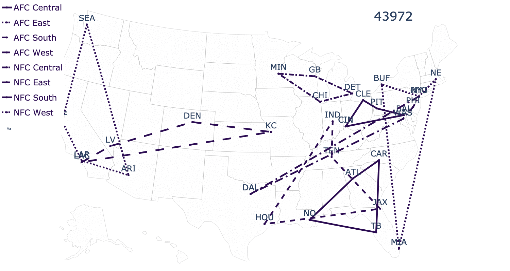

# sports-realignment
Nathan Brixius, May 2024

This is a Python package for realigning sports teams to minimize distance between teams in the same division. 
We call this Optimal League Realignment (OLR).
The methods in this package are based on those described in the preprint XXX.

Based on previous work in the operations research community, particularly that of Xi and Mitchell,
we implement a bilinear model formulation of OLR. We also provide the option for this formulation
to be solved as a mixed integer formulation. We support both the Gurobi (commercial) and SCIP
(open source) solvers via simple wrappers. For reference we also provide a simple greedy approach for OLR.

We provide input data for all major North American sports league as well as a few method for rendering 
results.

This package is a "for-fun" project and as such is not very well implemented or documented.
